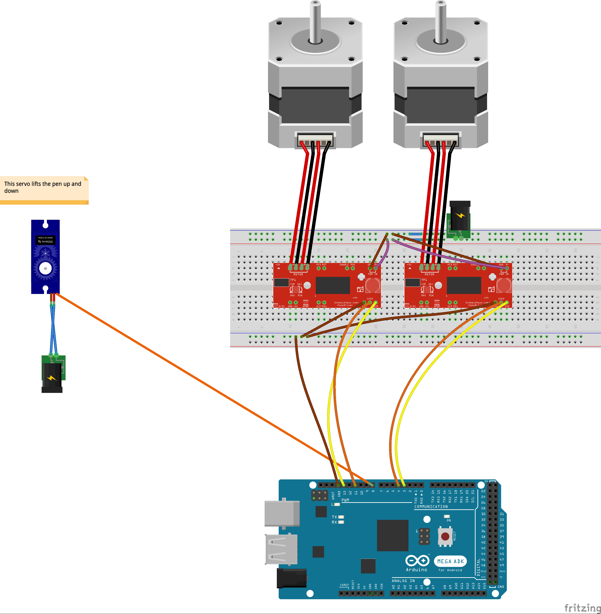
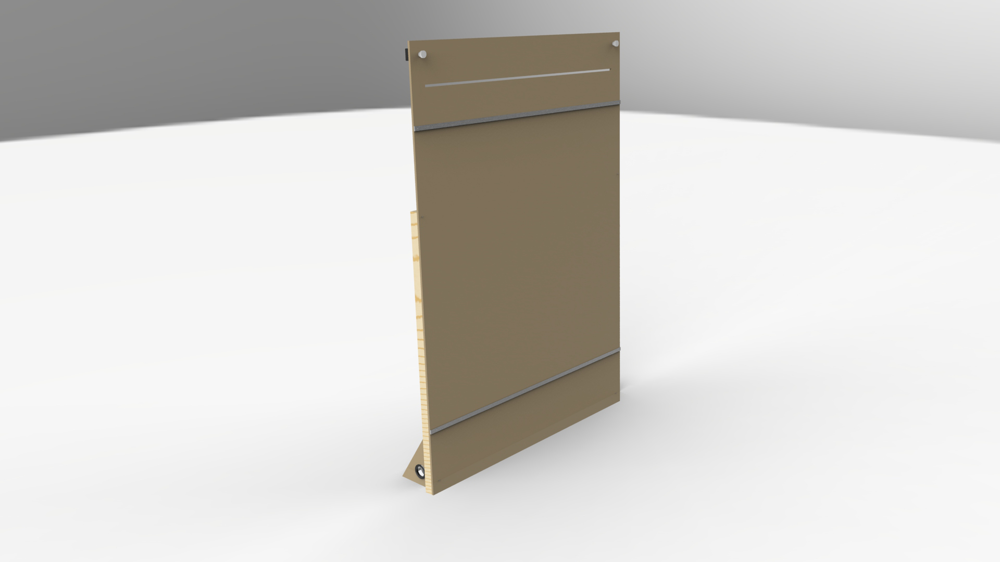
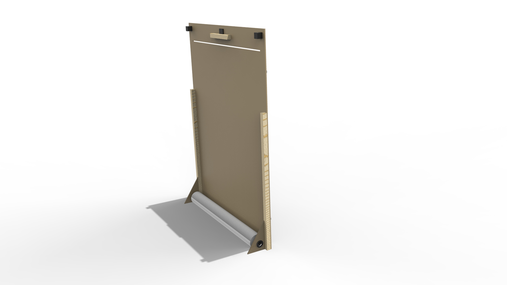
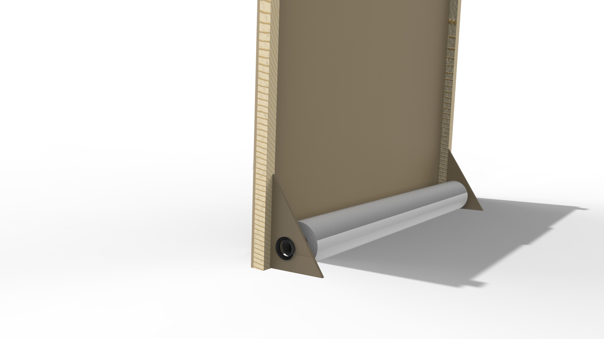
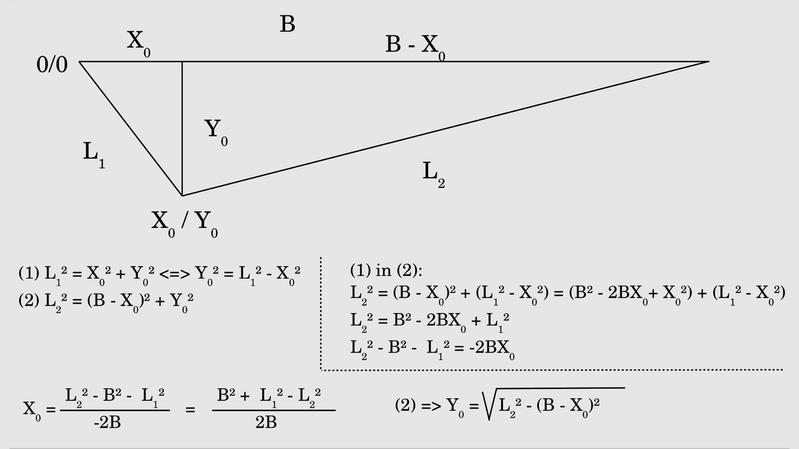
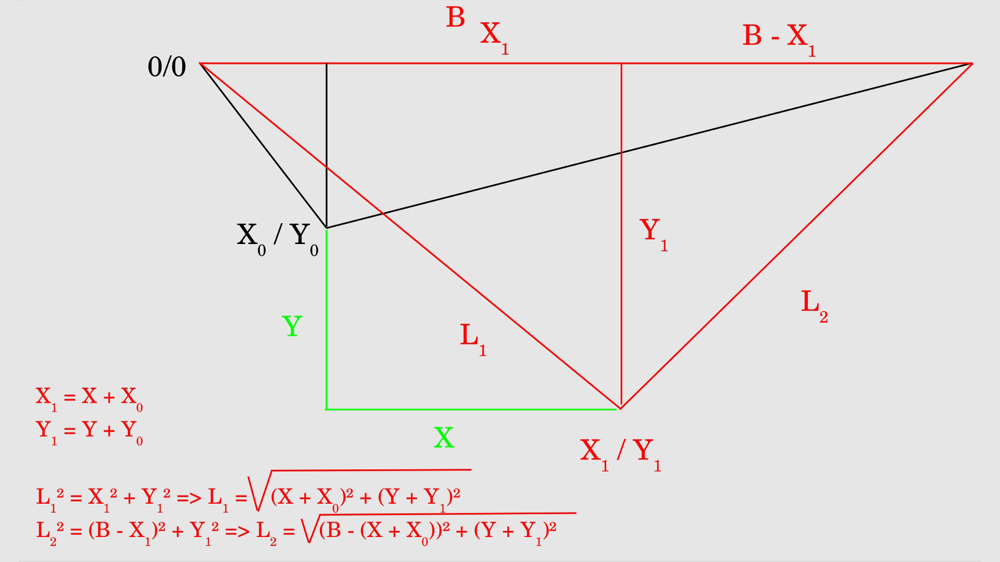
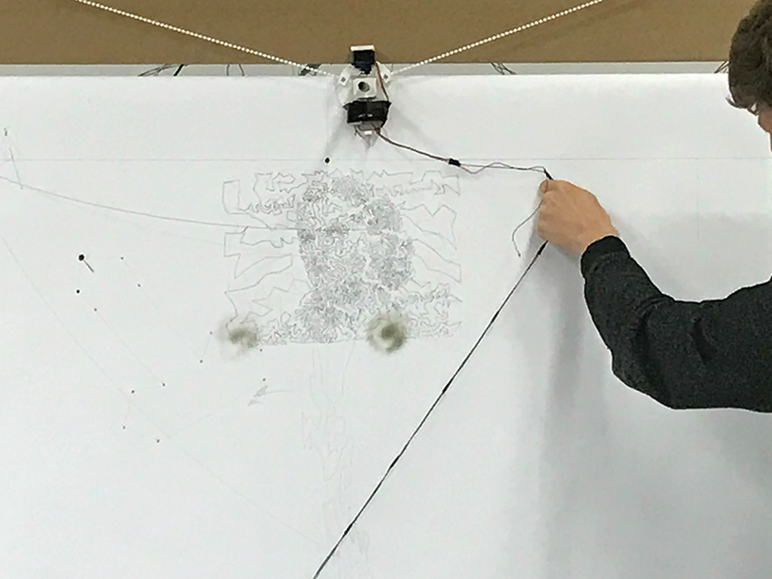
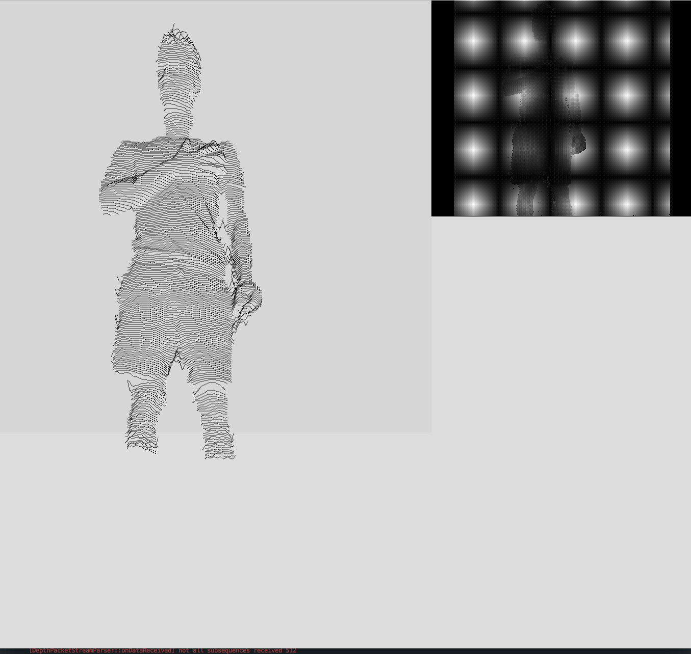
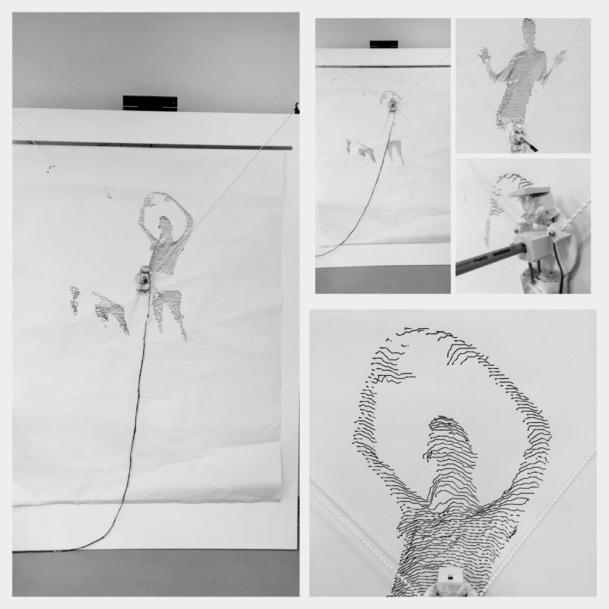

# depth2paper
**[video]**

## Introduction
This project is part of a class by [Fabian Moron-Zirfas](https://github.com/fabianmoronzirfas) at the University of Applied Sciences in Potsdam.
It explores the interactive possibilities with a vertical plotter. In this version depth2paper recognizes objects in front of it and prints out a picture according to the varying depths of the object.

## Tech specs
The depth2paper is a custom-made vertical plotter with a manual paper feed and various electronics. It consists of the following elements:
* 2 Arduino Mega w/ J5 installed
* 2 stepper motors
* 2 hardware drivers for the steppers
* 1 servo motor to lift the pen
* 2 electric transformer as individual energy sources
* 1 Microsoft Kinect V2



## The process
### Assignment
The assignment was to build and develop a machine that creates art – an "artomaton". Input and output needed to be specified. Four groups were formed to pitch the best project. The following idea was chosen to be followed:

### Initial idea
Inspired by the visuality of Tim Rieckes work [»con\texture\de\structure«](https://www.youtube.com/watch?v=uRK3V207iSk) the plan was to build a plotter that traces the visitors movements in space using an exhibition context. It was the goal to visualize parts of the reality, which are normally hidden und unnoticed to stimulate the relation between visitors and space. To make the speed of movement visible, the movement was observed in time and space. That means, that the lines tracing the visitors movement change their shape according to the velocity of movement. By changing the exhibits positions and the type of placement (on walls, in space, etc.) a new output should have been created every time. The exhibits thereby could actually have been called parameters that shape the visitors movement in space.

### Physical restrictions
Tracking people's behavior in a room was tested successfully with a framework called Tracking.js.
Still certain problems were difficult to solve:

1. A very high ceiling is necessary to hang the Kinect and track a whole room.
2. The system has to be very stable for good results, but the Kinect was handled with processing
3. The plotter is not drawing fast enough to follow people in real time
4. And most importantly but subjective: the outcome was hardly visual pleasing

### New approach

Instead of tracing movement in a room and thereby changes in depth within it, the new approach was to investigate depth in smaller objects, primarily human bodies. Because of the time limit the tracing of movement became impossible and was therefor ruled out. The objects were hence viewed at in a "frozen" condition resp. as a snapshot.


## Design


The depth2paper is made out of an MDF panel that serves as surface for the drawing area. The electronics for the vertical plotter is mounted on the top and on the back. The paper roll is also mounted on the backside of the depth2paper.

### Construction concept


The depth2paper is based on an MDF panel sized 145 x 200 x 1 cm with a 135 cm wide slot in the upper range. The plotters frame is assembled with a distance of 5cm on all sides.



Paper is conducted through the slot from an ongoing paper roll, so that the print area lays flat on the base area. The panel will not be installed vertically on the floor, but 10° bent to the back in order to grant a more exact control of the pen, but also to give quick access to wiring and paper feeding on the backside of the plotter. In order to achieve these benefits it was necessary to design an additional supporting structure.

### Building the plotter
These [instructions](http://www.makerblog.at/2014/09/vertikalplotter-im-selbstbau-teil-1-polargraph-kritzler-makelangelo-und-co/) by Adi Dax were used as reference and guideline.



The paper roll is fixed around a Plexiglas-tube between the triangular feet, that are holding the MDF panel. From there the paper is conducted up to the slot in the panel. On the front side the paper's hold is supported by two metal clamps.
Most of the electronics are positioned on the backside of the panel. The Kinect is positioned in the middle of the its top and one of the steppers on each side. They include 3D-printed gears that hold the chain and the pen in its 3D-printed holder.
The holder includes another servo motor, that can move the pen back and forth in order to control wether it draws or not.

### Software summary

The code can be found [here](https://github.com/LFra/artomaton). It consist of two separate code bases:

```artomaton-java```
includes the code responsible for the Kinect infrared image and the algorithm creating the line data. This data is then send to the node server via websockets.

```artomaton-node```
includes the code responsible for steering of the Plotbot using [johnny-five](https://github.com/rwaldron/johnny-five). It also transforms the cartesian coordinates, received from the java application, into bipolar ones.

Javascript was chosen as a basis because it was the single coding language everyone on the team had some experience with. This turned out to make things unnecessarily complicated in the end, since we needed a Java Interface to communicate with the Kinect camera.

The software phase started with the help of the [gocupi](https://github.com/brandonagr/gocupi) repository by brandonagr. The program requires three parameters to translate the cartesian coordinates into the two string lengths.
- the distance between the two stepper motors
- the length of both strings in idle position ({0,0} or top-left)
- the string length per one step of the motors (the length can vary for each of the two motors, even though they share the same model)
All of these parameters have to be measured with great precision, small deviation will lead to unexpected results. This caused a lot of trouble in the start of the development process.

**Mathematics**
The core of the program is this mathematical formula that converts cartesian coordinates (x, y) into string lengths using a bipolar system:

[Source](http://www.homofaciens.de/bilder/technik/v-plotter_010.htm)

[Source](http://www.homofaciens.de/bilder/technik/v-plotter_011.htm)

One of the first accomplishments with the plotter was drawing a SVG file depicting a portrait that was created with StrippleGen.



**Kinect**
The way to run a Kinect version two on Macintosh is through the OpenKinect framework for Processing.
This created two problem:
1. Java and Javascript have to run in the same time in individual processes
2. these two programs need a way to communicate

For the purpose of depth2paper the Kinetcs depth image was used to come up with the generated source image for the Plotbot. In its core the software produces lines, with their anchors shifted in ```y``` by the depth amount of the given point.
This step happens in the Java program before sending it to the node server in ```[[x, y], ... n]``` arrays, where n is the number of anchors per line.



It is a rather simple but visually quite pleasing effect with a strong reference to Joy Divisons famous album artwork. depth2paper was now able to record individual full-body-portraits of objects and humans.

**Conclusion**
The amount of time needed for the project exceeded the expectations by a landslide. One of the main issues, was the constant uncertainty about where the mistakes were hiding: at the motors and their drivers, the analog build-up or the inaccurate measurements – too often it seemed intransparent and unreliable, especially because working with microcontrollers was a novel territory for the software team.
Anyways, every so small goal towards the final product felt awesome after phases of trial and error and the received feedback was throughout amazing.


